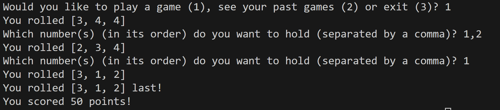
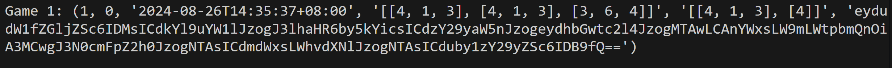

# Yahtzo Documentation

### Get Started
Just go ahead and run `tui.py` with your favourite Python interpreter to get started playing the game!

#### Default Rules
By default, with the TUI game, there are multiple ways to score on your final roll through the number combination:

* Three of a Kind: 70 points
* Straight (Three consecutive numbers): 50 points
* Full House (Two of one number, one of another): 50 points
* Three of a Kind with all sixes: 100 points

#### Holding
When navigating the menu, and selecting `1` to play a game, you will be instructed to select which numbers out of the rolled you want to hold for the next roll.

You do this by inputting a comma-separated list of the number(s), in its order, that you want to hold.

For example, let's say `[6, 3, 3]`is rolled

You want to hold both threes.

You would do this by inputting `2,3` when asked for the numbers you want to hold.

This is due to how `2` is the order of the 1st three, and how `3` is the order of the 2nd three.



#### Cool, how do we see our past games?
You can do this by selecting `2` in the main menu, which prints out all the past games you have played on the current database file.

The past games are in the format:

```(GAME_ID, SCORE, DATE_AND_TIME, ROLLS, HOLDS, BASE64_ENCODED_CONFIG)```



## Library Documentation
### Utilities
`calculate.py`:
* Used to calculate a score based on the roll list provided and the points definitions in the configuration file
* Exposed through the `calculate()` function, which takes a list of the final rolled numbers as an argument.

`read_config.py`:
* Used to read and parse the configuration file.
* Returns a `Config` object with the information provided in `config.json`
* Takes the argument of the location of the configuration file

`roll_dice.py`:
* Takes an argument of the number of dice as an int.
* Returns a list of the rolled numbers, according to the number of dice.

### Database
`def grab_db(database: str)`
* Takes a string argument of the path of the database file and checks if the database and its table has been created
* If it has not, it creates it.
* If it has, it returns a SQLite3 cursor object.

`def check_if_table_exists(cur: sqlite3.cursor, table_name: str)`
* Checks if a specific table has been created within a database
* Takes the arguments of a SQLite3 cursor object, and a string of the table name.
* Returns True if the table exists, otherwise False.

`def store_game(cur: sqlite3.Cursor, score: int, rolls: list, holds: list, current_config: str)`
* Stores provided game data as an entry in a provided SQLite database.
* Takes a SQLite3 Cursor object, the current score, the rolls that have taken place, the holds that have been taken, and the current_config encoded in base64.

`def get_last_result(cur: sqlite3.Cursor)`
* Gets the latest game result from the database.
* Takes a SQLite3 Cursor object.

`def get_high_score(cur: sqlite3.Cursor)`
* Gets the highest score ever achieved from the database.
* Take a SQLite3 Cursor object as an argument

## Configuration Documentation

`num_dice`
* By default, is set to 3.
* Specifies the number of dice to be rolled.

`db_name`
* Defaults to 'yahtzo.db'.
* Specifies the name of the database to use to store the game information.

`scoring`
* Contains key-value pairs of the different ways to score points and how many points are awarded

Example/Default Configuration:
```
{
    "num_dice": 3,
    "db_name": "yahtzo.db",
    "scoring": {
        "all-six": 100,
        "all-of-kind": 70,
        "straight": 50,
        "full-house": 50,
        "no-score": 0
    }
}
```
